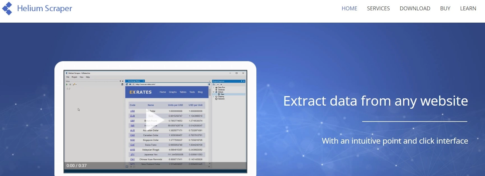

# Reddit数据采集工具选择指南：7款实用工具对比

在做社交媒体数据研究时，Reddit是个很难忽视的地方。这个平台上聚集着各种兴趣圈子的真实讨论，如果你想了解某个领域的用户真实想法，Reddit上的对话可能比任何市场调研报告都有价值。

问题是，Reddit虽然提供了官方API，但限制比较多，只能用来做些基础自动化操作。如果你需要系统性地收集和分析大量数据，还是得用专门的采集工具。下面介绍几个比较实用的选择。

---

## 1. Phantombuster

Phantombuster的定价从每月50美元起，提供14天试用期。它的优势在于不需要写代码就能完成自动化操作，数据可以导出为CSV或Excel格式，既支持本地存储也支持云端存储。

这个工具功能比较全面，适合那种需要定期采集特定subreddit数据的场景。不过需要注意的是，免费试用版有功能限制，想看完整效果还是得付费。

## 2. ScraperAPI

👉 [ScraperAPI提供5000次免费调用额度，适合快速验证数据采集需求](https://www.scraperapi.com/?fp_ref=coupons)

ScraperAPI同样是49美元起步，给5000个免费额度用来测试。它的特点是把技术门槛降得很低——自动处理验证码、IP轮换这些麻烦事，你只需要调用API就行。

对于不想在技术细节上花太多时间的人来说，这个工具挺合适的。数据导出格式支持Excel、CSV和Google Sheets，基本够用了。

## 3. Bright Data

Bright Data的起步价是500美元，包含151,000次页面加载。它提供的是企业级服务，有庞大的代理IP网络，包括住宅IP和移动IP。

这家的"数据收集器"功能比较有意思，预设了很多常见网站的采集模板。不过Reddit相关的模板不算多，可能需要找他们定制，或者自己写代码实现。如果你的需求比较特殊或者数据量很大，可以考虑这个选项。

## 4. Apify

Apify每月49美元，免费账户每月有5美元额度。它提供了现成的Reddit采集器，不需要使用官方API，也不需要登录Reddit账号。

这个工具的灵活性不错，既可以用云端服务也可以下载到本地。数据导出支持CSV等格式，对于中等规模的数据采集需求来说够用了。

## 5. Web Scraper

Web Scraper是个Chrome浏览器扩展，最大的优点是完全免费。虽然功能相对简单，只能导出CSV格式，但对于小规模、偶尔需要采集数据的场景已经够用了。

不需要编程知识，安装后直接在浏览器里操作就行。如果你只是想试试数据采集是怎么回事，或者需求不复杂，这个是最容易上手的选择。

## 6. Helium Scraper

Helium Scraper采用买断制，单个许可证99美元起，提供10天功能完整的试用期。这是个需要安装的桌面软件，支持Excel、CSV等多种导出格式。

👉 [对于需要处理复杂网页结构的场景，ScraperAPI的企业方案提供更稳定的解决思路](https://www.scraperapi.com/?fp_ref=coupons)

它处理复杂网页数据的能力比较强，界面也算友好。如果你需要频繁采集结构复杂的Reddit页面，这个工具值得考虑。

## 7. ParseHub

ParseHub起步价149美元，有免费的桌面版本但功能有限制。它支持云端和本地两种使用方式，可以导出为Excel等格式。

这是个通用的数据采集工具，不只能用于Reddit。功能比较高级，适合对数据采集有长期需求的情况。

---

## 几个常见问题

**为什么要采集Reddit数据？**

Reddit不只是个聊天的地方，它更像是个巨大的用户意见库。每个subreddit就是一个垂直领域的社区，里面的讨论都是真实的用户反馈。如果你在做市场调研或者内容策划，Reddit上的数据能告诉你用户真正在意什么、抱怨什么、期待什么。

**选择采集工具时要注意什么？**

首先是要能安全地采集数据，不要一上来就被Reddit识别封禁。其次是数据导出要方便，最好支持Excel或CSV这种常用格式。还有就是要考虑你的技术背景——如果不会编程，就选那种图形界面操作的工具；如果会写代码，API类的工具会更灵活。

**采集Reddit数据合法吗？**

采集公开数据本身不违法，但每个平台都有自己的使用条款。Reddit的规则相对宽松，但如果你要大规模采集，最好还是用专业工具，这样能避免被识别为异常行为。另外记住一点：只采集公开数据，不要尝试获取需要登录才能看到的私密内容。

---

## 总结

Reddit上的数据确实有价值，但采集方式要选对。用官方API的话限制太多，自己写爬虫又容易出问题。选个合适的工具能省不少事——根据你的预算和技术水平，上面这几个都是靠谱的选择。

如果只是偶尔用用，Web Scraper这种免费扩展就够了；如果是长期需求或者数据量大，还是得上ScraperAPI或Bright Data这种专业服务。工具选对了，后面的数据分析才能顺利展开。
